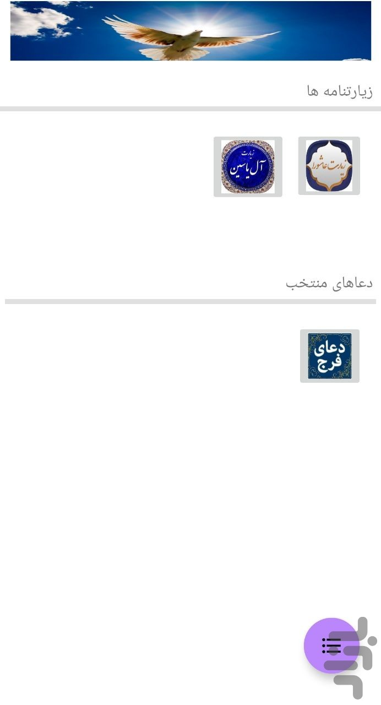

# PareParvaz

This application is prepared for you to communicate with the merciful God.

## Table of Content 
- [specification](#specification)
- [libraries](#libraries)
- [screenshots](#screenshots)

## specification 
- 33 < SdkVersion > 23 (6 < AndroidVersion > 13)
- Kotlin 1.10.1

## libraries 
- constraintlayout

## ScreenShots 

HomePage

    

Page 1 :

    

page 2:

    

